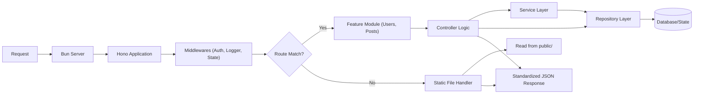

# Architecture Overview

This project implements a **Production-Ready, Rust-Inspired Backend Architecture**. It leverages [Hono](https://hono.dev/) for a lightweight, standards-based server running on the high-performance [Bun](https://bun.sh/) runtime.

The core philosophy is to enforce **strict type safety** and **architectural discipline**, mimicking the robustness of Rust systems within a TypeScript environment.

## High-Level Design

The design is built around three pillars of strictness:

1.  **Modular Domain-Driven Design (DDD)**: Logic is encapsulated in self-contained feature modules.
2.  **Dependency Injection**: Global state (DB, Config) is injected into every request context, ensuring testability and stateless handlers.
3.  **Strict Data Flow**: All inputs are validated (Zod), and all outputs utilize standardized envelopes.

### System Data Flow

## Core Components

### 1. Server Entry Point (`src/main.ts`)

The application entry point is responsible for bootstrapping the environment. It performs two critical steps:

1.  **State Initialization**: Connects to databases and loads configuration.
2.  **Server Startup**: Uses `Bun.serve` to start the HTTP or HTTPS server based on configuration.

### 2. State Management (`src/state.ts`)

Application state is a singleton created at startup and **injected** into every request. It serves as the "single source of truth" for the infrastructure:

- **Config**: Validated environment variables.
- **Database**: Connection pools (e.g., Postgres, Redis) or mock stores.

This state is accessible in every handler via `c.get('state')`, preventing global variable usage and Side-Effects.

### 3. Routing Strategy (`src/routes.ts`)

The router prioritizes API logic while supporting static assets for landing pages or documentation:

1.  **API Modules**: Explicit routes (e.g., `/user`, `/post`) are routed to their respective modules.
2.  **Static Fallback**: Unmatched routes are checked against the `public/` directory to serve static files (e.g., `index.html`, robots.txt).
3.  **404 Handler**: If neither logic nor file matches, a standardized JSON 404 is returned.

### 4. Modular Architecture (`src/modules/`)

Each feature (e.g., `users`) is a self-contained unit following strict layers:

- **`model.ts`**: Zod Schemas and TypeScript Types. **No logic.**
- **`repository.ts`**: Data Access Layer. SQL/Storage operations using Drizzle. **No business logic.**
- **`service.ts`**: Pure Business Logic. Orchestrates repositories, validation, and complex flows. **No HTTP knowledge.**
- **`controller.ts`**: HTTP Layer. Handles Request/Response, calls Service/Repository. **Uses `createHandler`, `createJsonHandler`, etc.**
- **`index.ts`**: Route definitions mapping paths to controllers.

### 5. Utilities (`src/utils/`)

Shared tools to enforce consistency:

- **Handler Generators**: Higher-order functions (`createHandler`, `createJsonHandler`, `createFormHandler`) that wrap controllers. They manage error handling, context injection, and strict type safety for request bodies.
- **`response.ts`**: Enforces strict JSON envelopes (`success`, `data`, `meta`, `message`).
- **`log.ts`**: Structural logging utility.
- **`result.ts`**: Rust-inspired `Result` type pattern for robust error handling.

## Directory Structure

- `src/middlewares`: Global middleware (interceptors).
- `src/modules`: Domain feature packages.
- `src/public`: Public assets (Landing page, static files).
- `src/utils`: Common helper functions.
